# RULE业务

## 1. 期权期货式结算

### 1.1 股票式vs期货式

现有期权结算方式为股票式结算，RULE为期货式，两种方式结算差异：

| 期权结算方式 | 权利金                                                 | 保证金                 | 盈亏               |
| ------------ | ------------------------------------------------------ | ---------------------- | ------------------ |
| 股票式       | 期权开平仓时，买方支付权利金，卖方收取权利金           | 卖方收取保证金         | 不计算             |
| 期货式       | 期权行权或者期权到期时，买方支付权利金，卖方收取权利金 | 买方和卖方均收取保证金 | 逐日盯式的原则计算 |

### 1.2 期权保证金

|      | 期权保证金                            |
| ---- | ------------------------------------- |
| 买方 | min(期权权利金, \|delta\|*期货保证金) |
| 卖方 | \|delta\|*期货保证金                  |

说明：

* delta：为复合delta，也称加权delta，区别于期权风险参数里的delta，是将多个场景（标的价格不同）的delta通过加权得到。
* 期货保证金是标的期货保证金

如果考虑期权的看涨和看跌：

|      | 看涨/看跌 | 期权保证金                              |
| ---- | --------- | --------------------------------------- |
| 买方 | 看涨      | min(期权权利金, \|delta\|*期货买保证金) |
| 买方 | 看跌      | min(期货权利金, \|delta\|*期货卖保证金) |
| 卖方 | 看涨      | \|delta\|*期货卖保证金                  |
| 卖方 | 看跌      | \|delta\|*期货买保证金                  |

#### 1.2.1 期权合约类型

##### 微值期权

微值期权，也称深虚值期权，其复合delta满足：|复合delta| ≤ x(x可以设置在品种或者系列上)

|      | 微值期权保证金                |
| ---- | ----------------------------- |
| 买方 | min(期权权利金, x*期货保证金) |
| 卖方 | x*期货保证金                  |

微值期权不参与组合（不参与RULE组合保证金计算）。

##### 交割月期权、非交割月期权

通过参数定义交割月范围。

##### 临近到期期权

以期权到期前N月第M个交易日为分界，判断临近到期期权。

|      | 临近到期期权保证金         |
| ---- | -------------------------- |
| 买方 | 期权权利金                 |
| 卖方 | 复合delta分界值*期货保证金 |

复合delta分界值为参数表中第一个大于等于复合delta的参数。

举例：参数表的参数为0.2和0.6，复合delta为0.55，则复合delta分界值为0.6。

临近到期期权不参与组合。

##### 不参与组合期权

支持设置不参与组合的期权合约。

##### 期权合约类型示意图

* 绿色均不参与组合
* 保证金计算优先级：临近到期>微值期权

#### 1.2.2 期权附加风险

期权附加风险分为两种，通过参数设置：

* 附加风险额：买/卖一手附加的保证金，参数设置的是保证金。
* 比例值附加风险：期权保证金*比例值，参数设置的是比例值，算出的结果即买/卖一手附加的保证金。

## 2. RULE保证金

### 2.1 折算为标准合约

每个品种都有一个标准合约（期货），默认是主力合约，可以设置。该品种所有期货和期权合约都要计算相对于标准合约的折算系数。

| 折算系数 | 期权或者期货合约                      |
| -------- | ------------------------------------- |
| 投机买   | 合约投机买保证金/标准合约投机买保证金 |
| 投机卖   | 合约投机卖保证金/标准合约投机买保证金 |
| 套保买   | 合约套保买保证金/标准合约投机买保证金 |
| 套保卖   | 合约套保卖保证金/标准合约投机买保证金 |

通过折算系数将合约持仓折算为标准合约持仓。

### 2.2 RULE保证金

说明：

* 交割月合约不参与品种间对冲

